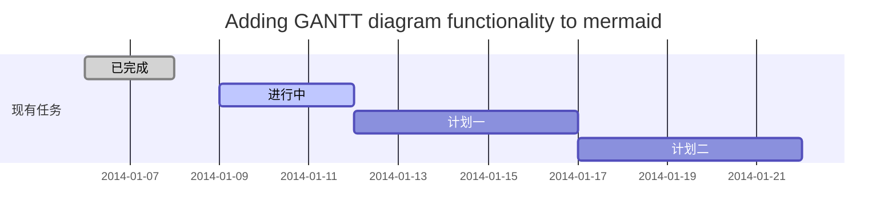
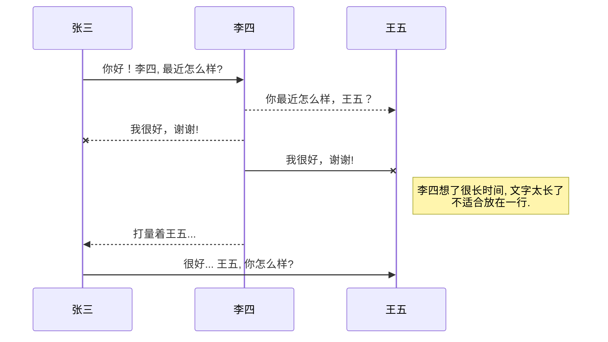
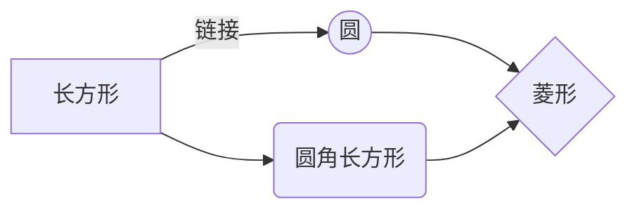

# 欢迎使用Markdown编辑器

你好！ 这是你第一次使用 **Markdown编辑器** 所展示的欢迎页。如果你想学习如何使用Markdown编辑器, 可以仔细阅读这篇文章，了解一下Markdown的基本语法知识。

## 新的改变

我们对Markdown编辑器进行了一些功能拓展与语法支持，除了标准的Markdown编辑器功能，我们增加了如下几点新功能，帮助你用它写博客：
 1. **全新的界面设计** ，将会带来全新的写作体验；
 2. 在创作中心设置你喜爱的代码高亮样式，Markdown **将代码片显示选择的高亮样式** 进行展示；
 3. 增加了 **图片拖拽** 功能，你可以将本地的图片直接拖拽到编辑区域直接展示；
 4. 全新的 **KaTeX数学公式** 语法；
 5. 增加了支持**甘特图的mermaid语法[^1]** 功能；
 6. 增加了 **多屏幕编辑** Markdown文章功能；
 7. 增加了 **焦点写作模式、预览模式、简洁写作模式、左右区域同步滚轮设置** 等功能，功能按钮位于编辑区域与预览区域中间；
 8. 增加了 **检查列表** 功能。
 [^1]: [mermaid语法说明](https://mermaidjs.github.io/)

## 功能快捷键

撤销：<kbd>Ctrl/Command</kbd> + <kbd>Z</kbd>
重做：<kbd>Ctrl/Command</kbd> + <kbd>Y</kbd>
加粗：<kbd>Ctrl/Command</kbd> + <kbd>B</kbd>
斜体：<kbd>Ctrl/Command</kbd> + <kbd>I</kbd>
标题：<kbd>Ctrl/Command</kbd> + <kbd>Shift</kbd> + <kbd>H</kbd>
无序列表：<kbd>Ctrl/Command</kbd> + <kbd>Shift</kbd> + <kbd>U</kbd>
有序列表：<kbd>Ctrl/Command</kbd> + <kbd>Shift</kbd> + <kbd>O</kbd>
检查列表：<kbd>Ctrl/Command</kbd> + <kbd>Shift</kbd> + <kbd>C</kbd>
插入代码：<kbd>Ctrl/Command</kbd> + <kbd>Shift</kbd> + <kbd>K</kbd>
插入链接：<kbd>Ctrl/Command</kbd> + <kbd>Shift</kbd> + <kbd>L</kbd>
插入图片：<kbd>Ctrl/Command</kbd> + <kbd>Shift</kbd> + <kbd>G</kbd>
查找：<kbd>Ctrl/Command</kbd> + <kbd>F</kbd>
替换：<kbd>Ctrl/Command</kbd> + <kbd>G</kbd>

## 合理的创建标题，有助于目录的生成

直接输入1次<kbd>#</kbd>，并按下<kbd>space</kbd>后，将生成1级标题。
输入2次<kbd>#</kbd>，并按下<kbd>space</kbd>后，将生成2级标题。
以此类推，我们支持6级标题。有助于使用`TOC`语法后生成一个完美的目录。

## 如何改变文本的样式

*强调文本* _强调文本_

**加粗文本** __加粗文本__

==标记文本==

~~删除文本~~

> 引用文本

H~2~O is是液体。

2^10^ 运算结果是 1024.

## 插入链接与图片

链接: [link](https://www.csdn.net/).

图片: 

带尺寸的图片: 

居中的图片: 

居中并且带尺寸的图片: 

当然，我们为了让用户更加便捷，我们增加了图片拖拽功能。

## 如何插入一段漂亮的代码片

去[博客设置](https://mp.csdn.net/console/configBlog)页面，选择一款你喜欢的代码片高亮样式，下面展示同样高亮的 `代码片`.
```javascript
// An highlighted block
var foo = 'bar';
```

## 生成一个适合你的列表

- 项目
  - 项目
    - 项目

1. 项目1
2. 项目2
3. 项目3

- [ ] 计划任务
- [x] 完成任务

## 创建一个表格
一个简单的表格是这么创建的：
项目     | Value
-------- | -----
电脑  | $1600
手机  | $12
导管  | $1

### 设定内容居中、居左、居右
使用`:---------:`居中
使用`:----------`居左
使用`----------:`居右
| 第一列       | 第二列         | 第三列        |
|:-----------:| -------------:|:-------------|
| 第一列文本居中 | 第二列文本居右  | 第三列文本居左 |

### SmartyPants
SmartyPants将ASCII标点字符转换为“智能”印刷标点HTML实体。例如：
|    TYPE   |ASCII                          |HTML
|----------------|-------------------------------|-----------------------------|
|Single backticks|`'Isn't this fun?'`            |'Isn't this fun?'            |
|Quotes          |`"Isn't this fun?"`            |"Isn't this fun?"            |
|Dashes          |`-- is en-dash, --- is em-dash`|-- is en-dash, --- is em-dash|

## 创建一个自定义列表
Markdown
:  Text-to-HTML conversion tool

Authors
:  John
:  Luke

## 如何创建一个注脚

一个具有注脚的文本。[^2]

[^2]: 注脚的解释

##  注释也是必不可少的

Markdown将文本转换为 HTML。

*[HTML]:   超文本标记语言

## 新的甘特图功能，丰富你的文章


- 关于 **甘特图** 语法，参考 [这儿][2],

## UML 图表

可以使用UML图表进行渲染。 [Mermaid](https://mermaidjs.github.io/). 例如下面产生的一个序列图：



这将产生一个流程图。:



- 关于 **Mermaid** 语法，参考 [这儿][3],

## 导出与导入

###  导出
如果你想尝试使用此编辑器, 你可以在此篇文章任意编辑。当你完成了一篇文章的写作, 在上方工具栏找到 **文章导出** ，生成一个.md文件或者.html文件进行本地保存。

### 导入
如果你想加载一篇你写过的.md文件，在上方工具栏可以选择导入功能进行对应扩展名的文件导入，
继续你的创作。

 [1]: http://meta.math.stackexchange.com/questions/5020/mathjax-basic-tutorial-and-quick-reference
 [2]: https://mermaidjs.github.io/
 [3]: https://mermaidjs.github.io/
 [4]: http://adrai.github.io/flowchart.js/

### 视频
下面是一个视频嵌入示例：
<div class="aspect-video rounded-xl overflow-hidden">
  <iframe class="w-full h-full" src="https://www.youtube.com/embed/dQw4w9WgXcQ" title="Video demo" frameborder="0" allow="accelerometer; autoplay; clipboard-write; encrypted-media; gyroscope; picture-in-picture" allowfullscreen></iframe>
</div><meta charset='utf-8'><div style="color: #d1d3db;background-color: #1a1b1d;font-family: 'JetBrains Mono', Menlo, Monaco, 'Courier New', monospace;font-weight: normal;font-size: 13px;line-height: 22px;white-space: pre;"><div><span style="color: #80bbff;font-weight: bold;"># 欢迎使用Markdown编辑器</span></div><br><div><span style="color: #d1d3db;">你好！ 这是你第一次使用 </span><span style="color: #d5d8e0;font-weight: bold;">**Markdown编辑器**</span><span style="color: #d1d3db;"> 所展示的欢迎页。如果你想学习如何使用Markdown编辑器, 可以仔细阅读这篇文章，了解一下Markdown的基本语法知识。</span></div><br><div><span style="color: #80bbff;font-weight: bold;">## 新的改变</span></div><br><div><span style="color: #d1d3db;">我们对Markdown编辑器进行了一些功能拓展与语法支持，除了标准的Markdown编辑器功能，我们增加了如下几点新功能，帮助你用它写博客：</span></div><div><span style="color: #d1d3db;"> </span><span style="color: #f2858c;">1.</span><span style="color: #d1d3db;"> </span><span style="color: #d5d8e0;font-weight: bold;">**全新的界面设计**</span><span style="color: #d1d3db;"> ，将会带来全新的写作体验；</span></div><div><span style="color: #d1d3db;"> </span><span style="color: #f2858c;">2.</span><span style="color: #d1d3db;"> 在创作中心设置你喜爱的代码高亮样式，Markdown </span><span style="color: #d5d8e0;font-weight: bold;">**将代码片显示选择的高亮样式**</span><span style="color: #d1d3db;"> 进行展示；</span></div><div><span style="color: #d1d3db;"> </span><span style="color: #f2858c;">3.</span><span style="color: #d1d3db;"> 增加了 </span><span style="color: #d5d8e0;font-weight: bold;">**图片拖拽**</span><span style="color: #d1d3db;"> 功能，你可以将本地的图片直接拖拽到编辑区域直接展示；</span></div><div><span style="color: #d1d3db;"> </span><span style="color: #f2858c;">4.</span><span style="color: #d1d3db;"> 全新的 </span><span style="color: #d5d8e0;font-weight: bold;">**KaTeX数学公式**</span><span style="color: #d1d3db;"> 语法；</span></div><div><span style="color: #d1d3db;"> </span><span style="color: #f2858c;">5.</span><span style="color: #d1d3db;"> 增加了支持</span><span style="color: #d5d8e0;font-weight: bold;">**甘特图的mermaid语法[</span><span style="color: #82d99f;font-weight: bold;">^1</span><span style="color: #d5d8e0;font-weight: bold;">]**</span><span style="color: #d1d3db;"> 功能；</span></div><div><span style="color: #d1d3db;"> </span><span style="color: #f2858c;">6.</span><span style="color: #d1d3db;"> 增加了 </span><span style="color: #d5d8e0;font-weight: bold;">**多屏幕编辑**</span><span style="color: #d1d3db;"> Markdown文章功能；</span></div><div><span style="color: #d1d3db;"> </span><span style="color: #f2858c;">7.</span><span style="color: #d1d3db;"> 增加了 </span><span style="color: #d5d8e0;font-weight: bold;">**焦点写作模式、预览模式、简洁写作模式、左右区域同步滚轮设置**</span><span style="color: #d1d3db;"> 等功能，功能按钮位于编辑区域与预览区域中间；</span></div><div><span style="color: #d1d3db;"> </span><span style="color: #f2858c;">8.</span><span style="color: #d1d3db;"> 增加了 </span><span style="color: #d5d8e0;font-weight: bold;">**检查列表**</span><span style="color: #d1d3db;"> 功能。</span></div><div><span style="color: #d1d3db;"> [^1]: </span><span style="color: #d1d3db;text-decoration: underline;">[mermaid语法说明]</span><span style="color: #82d99f;">(https://mermaidjs.github.io/)</span></div><br><div><span style="color: #80bbff;font-weight: bold;">## 功能快捷键</span></div><br><div><span style="color: #d1d3db;">撤销：</span><span style="color: #d5d8e0;">&lt;</span><span style="color: #f2858c;">kbd</span><span style="color: #d5d8e0;">&gt;</span><span style="color: #d1d3db;">Ctrl/Command</span><span style="color: #d5d8e0;">&lt;/</span><span style="color: #f2858c;">kbd</span><span style="color: #d5d8e0;">&gt;</span><span style="color: #d1d3db;"> + </span><span style="color: #d5d8e0;">&lt;</span><span style="color: #f2858c;">kbd</span><span style="color: #d5d8e0;">&gt;</span><span style="color: #d1d3db;">Z</span><span style="color: #d5d8e0;">&lt;/</span><span style="color: #f2858c;">kbd</span><span style="color: #d5d8e0;">&gt;</span></div><div><span style="color: #d1d3db;">重做：</span><span style="color: #d5d8e0;">&lt;</span><span style="color: #f2858c;">kbd</span><span style="color: #d5d8e0;">&gt;</span><span style="color: #d1d3db;">Ctrl/Command</span><span style="color: #d5d8e0;">&lt;/</span><span style="color: #f2858c;">kbd</span><span style="color: #d5d8e0;">&gt;</span><span style="color: #d1d3db;"> + </span><span style="color: #d5d8e0;">&lt;</span><span style="color: #f2858c;">kbd</span><span style="color: #d5d8e0;">&gt;</span><span style="color: #d1d3db;">Y</span><span style="color: #d5d8e0;">&lt;/</span><span style="color: #f2858c;">kbd</span><span style="color: #d5d8e0;">&gt;</span></div><div><span style="color: #d1d3db;">加粗：</span><span style="color: #d5d8e0;">&lt;</span><span style="color: #f2858c;">kbd</span><span style="color: #d5d8e0;">&gt;</span><span style="color: #d1d3db;">Ctrl/Command</span><span style="color: #d5d8e0;">&lt;/</span><span style="color: #f2858c;">kbd</span><span style="color: #d5d8e0;">&gt;</span><span style="color: #d1d3db;"> + </span><span style="color: #d5d8e0;">&lt;</span><span style="color: #f2858c;">kbd</span><span style="color: #d5d8e0;">&gt;</span><span style="color: #d1d3db;">B</span><span style="color: #d5d8e0;">&lt;/</span><span style="color: #f2858c;">kbd</span><span style="color: #d5d8e0;">&gt;</span></div><div><span style="color: #d1d3db;">斜体：</span><span style="color: #d5d8e0;">&lt;</span><span style="color: #f2858c;">kbd</span><span style="color: #d5d8e0;">&gt;</span><span style="color: #d1d3db;">Ctrl/Command</span><span style="color: #d5d8e0;">&lt;/</span><span style="color: #f2858c;">kbd</span><span style="color: #d5d8e0;">&gt;</span><span style="color: #d1d3db;"> + </span><span style="color: #d5d8e0;">&lt;</span><span style="color: #f2858c;">kbd</span><span style="color: #d5d8e0;">&gt;</span><span style="color: #d1d3db;">I</span><span style="color: #d5d8e0;">&lt;/</span><span style="color: #f2858c;">kbd</span><span style="color: #d5d8e0;">&gt;</span></div><div><span style="color: #d1d3db;">标题：</span><span style="color: #d5d8e0;">&lt;</span><span style="color: #f2858c;">kbd</span><span style="color: #d5d8e0;">&gt;</span><span style="color: #d1d3db;">Ctrl/Command</span><span style="color: #d5d8e0;">&lt;/</span><span style="color: #f2858c;">kbd</span><span style="color: #d5d8e0;">&gt;</span><span style="color: #d1d3db;"> + </span><span style="color: #d5d8e0;">&lt;</span><span style="color: #f2858c;">kbd</span><span style="color: #d5d8e0;">&gt;</span><span style="color: #d1d3db;">Shift</span><span style="color: #d5d8e0;">&lt;/</span><span style="color: #f2858c;">kbd</span><span style="color: #d5d8e0;">&gt;</span><span style="color: #d1d3db;"> + </span><span style="color: #d5d8e0;">&lt;</span><span style="color: #f2858c;">kbd</span><span style="color: #d5d8e0;">&gt;</span><span style="color: #d1d3db;">H</span><span style="color: #d5d8e0;">&lt;/</span><span style="color: #f2858c;">kbd</span><span style="color: #d5d8e0;">&gt;</span></div><div><span style="color: #d1d3db;">无序列表：</span><span style="color: #d5d8e0;">&lt;</span><span style="color: #f2858c;">kbd</span><span style="color: #d5d8e0;">&gt;</span><span style="color: #d1d3db;">Ctrl/Command</span><span style="color: #d5d8e0;">&lt;/</span><span style="color: #f2858c;">kbd</span><span style="color: #d5d8e0;">&gt;</span><span style="color: #d1d3db;"> + </span><span style="color: #d5d8e0;">&lt;</span><span style="color: #f2858c;">kbd</span><span style="color: #d5d8e0;">&gt;</span><span style="color: #d1d3db;">Shift</span><span style="color: #d5d8e0;">&lt;/</span><span style="color: #f2858c;">kbd</span><span style="color: #d5d8e0;">&gt;</span><span style="color: #d1d3db;"> + </span><span style="color: #d5d8e0;">&lt;</span><span style="color: #f2858c;">kbd</span><span style="color: #d5d8e0;">&gt;</span><span style="color: #d1d3db;">U</span><span style="color: #d5d8e0;">&lt;/</span><span style="color: #f2858c;">kbd</span><span style="color: #d5d8e0;">&gt;</span></div><div><span style="color: #d1d3db;">有序列表：</span><span style="color: #d5d8e0;">&lt;</span><span style="color: #f2858c;">kbd</span><span style="color: #d5d8e0;">&gt;</span><span style="color: #d1d3db;">Ctrl/Command</span><span style="color: #d5d8e0;">&lt;/</span><span style="color: #f2858c;">kbd</span><span style="color: #d5d8e0;">&gt;</span><span style="color: #d1d3db;"> + </span><span style="color: #d5d8e0;">&lt;</span><span style="color: #f2858c;">kbd</span><span style="color: #d5d8e0;">&gt;</span><span style="color: #d1d3db;">Shift</span><span style="color: #d5d8e0;">&lt;/</span><span style="color: #f2858c;">kbd</span><span style="color: #d5d8e0;">&gt;</span><span style="color: #d1d3db;"> + </span><span style="color: #d5d8e0;">&lt;</span><span style="color: #f2858c;">kbd</span><span style="color: #d5d8e0;">&gt;</span><span style="color: #d1d3db;">O</span><span style="color: #d5d8e0;">&lt;/</span><span style="color: #f2858c;">kbd</span><span style="color: #d5d8e0;">&gt;</span></div><div><span style="color: #d1d3db;">检查列表：</span><span style="color: #d5d8e0;">&lt;</span><span style="color: #f2858c;">kbd</span><span style="color: #d5d8e0;">&gt;</span><span style="color: #d1d3db;">Ctrl/Command</span><span style="color: #d5d8e0;">&lt;/</span><span style="color: #f2858c;">kbd</span><span style="color: #d5d8e0;">&gt;</span><span style="color: #d1d3db;"> + </span><span style="color: #d5d8e0;">&lt;</span><span style="color: #f2858c;">kbd</span><span style="color: #d5d8e0;">&gt;</span><span style="color: #d1d3db;">Shift</span><span style="color: #d5d8e0;">&lt;/</span><span style="color: #f2858c;">kbd</span><span style="color: #d5d8e0;">&gt;</span><span style="color: #d1d3db;"> + </span><span style="color: #d5d8e0;">&lt;</span><span style="color: #f2858c;">kbd</span><span style="color: #d5d8e0;">&gt;</span><span style="color: #d1d3db;">C</span><span style="color: #d5d8e0;">&lt;/</span><span style="color: #f2858c;">kbd</span><span style="color: #d5d8e0;">&gt;</span></div><div><span style="color: #d1d3db;">插入代码：</span><span style="color: #d5d8e0;">&lt;</span><span style="color: #f2858c;">kbd</span><span style="color: #d5d8e0;">&gt;</span><span style="color: #d1d3db;">Ctrl/Command</span><span style="color: #d5d8e0;">&lt;/</span><span style="color: #f2858c;">kbd</span><span style="color: #d5d8e0;">&gt;</span><span style="color: #d1d3db;"> + </span><span style="color: #d5d8e0;">&lt;</span><span style="color: #f2858c;">kbd</span><span style="color: #d5d8e0;">&gt;</span><span style="color: #d1d3db;">Shift</span><span style="color: #d5d8e0;">&lt;/</span><span style="color: #f2858c;">kbd</span><span style="color: #d5d8e0;">&gt;</span><span style="color: #d1d3db;"> + </span><span style="color: #d5d8e0;">&lt;</span><span style="color: #f2858c;">kbd</span><span style="color: #d5d8e0;">&gt;</span><span style="color: #d1d3db;">K</span><span style="color: #d5d8e0;">&lt;/</span><span style="color: #f2858c;">kbd</span><span style="color: #d5d8e0;">&gt;</span></div><div><span style="color: #d1d3db;">插入链接：</span><span style="color: #d5d8e0;">&lt;</span><span style="color: #f2858c;">kbd</span><span style="color: #d5d8e0;">&gt;</span><span style="color: #d1d3db;">Ctrl/Command</span><span style="color: #d5d8e0;">&lt;/</span><span style="color: #f2858c;">kbd</span><span style="color: #d5d8e0;">&gt;</span><span style="color: #d1d3db;"> + </span><span style="color: #d5d8e0;">&lt;</span><span style="color: #f2858c;">kbd</span><span style="color: #d5d8e0;">&gt;</span><span style="color: #d1d3db;">Shift</span><span style="color: #d5d8e0;">&lt;/</span><span style="color: #f2858c;">kbd</span><span style="color: #d5d8e0;">&gt;</span><span style="color: #d1d3db;"> + </span><span style="color: #d5d8e0;">&lt;</span><span style="color: #f2858c;">kbd</span><span style="color: #d5d8e0;">&gt;</span><span style="color: #d1d3db;">L</span><span style="color: #d5d8e0;">&lt;/</span><span style="color: #f2858c;">kbd</span><span style="color: #d5d8e0;">&gt;</span></div><div><span style="color: #d1d3db;">插入图片：</span><span style="color: #d5d8e0;">&lt;</span><span style="color: #f2858c;">kbd</span><span style="color: #d5d8e0;">&gt;</span><span style="color: #d1d3db;">Ctrl/Command</span><span style="color: #d5d8e0;">&lt;/</span><span style="color: #f2858c;">kbd</span><span style="color: #d5d8e0;">&gt;</span><span style="color: #d1d3db;"> + </span><span style="color: #d5d8e0;">&lt;</span><span style="color: #f2858c;">kbd</span><span style="color: #d5d8e0;">&gt;</span><span style="color: #d1d3db;">Shift</span><span style="color: #d5d8e0;">&lt;/</span><span style="color: #f2858c;">kbd</span><span style="color: #d5d8e0;">&gt;</span><span style="color: #d1d3db;"> + </span><span style="color: #d5d8e0;">&lt;</span><span style="color: #f2858c;">kbd</span><span style="color: #d5d8e0;">&gt;</span><span style="color: #d1d3db;">G</span><span style="color: #d5d8e0;">&lt;/</span><span style="color: #f2858c;">kbd</span><span style="color: #d5d8e0;">&gt;</span></div><div><span style="color: #d1d3db;">查找：</span><span style="color: #d5d8e0;">&lt;</span><span style="color: #f2858c;">kbd</span><span style="color: #d5d8e0;">&gt;</span><span style="color: #d1d3db;">Ctrl/Command</span><span style="color: #d5d8e0;">&lt;/</span><span style="color: #f2858c;">kbd</span><span style="color: #d5d8e0;">&gt;</span><span style="color: #d1d3db;"> + </span><span style="color: #d5d8e0;">&lt;</span><span style="color: #f2858c;">kbd</span><span style="color: #d5d8e0;">&gt;</span><span style="color: #d1d3db;">F</span><span style="color: #d5d8e0;">&lt;/</span><span style="color: #f2858c;">kbd</span><span style="color: #d5d8e0;">&gt;</span></div><div><span style="color: #d1d3db;">替换：</span><span style="color: #d5d8e0;">&lt;</span><span style="color: #f2858c;">kbd</span><span style="color: #d5d8e0;">&gt;</span><span style="color: #d1d3db;">Ctrl/Command</span><span style="color: #d5d8e0;">&lt;/</span><span style="color: #f2858c;">kbd</span><span style="color: #d5d8e0;">&gt;</span><span style="color: #d1d3db;"> + </span><span style="color: #d5d8e0;">&lt;</span><span style="color: #f2858c;">kbd</span><span style="color: #d5d8e0;">&gt;</span><span style="color: #d1d3db;">G</span><span style="color: #d5d8e0;">&lt;/</span><span style="color: #f2858c;">kbd</span><span style="color: #d5d8e0;">&gt;</span></div><br><div><span style="color: #80bbff;font-weight: bold;">## 合理的创建标题，有助于目录的生成</span></div><br><div><span style="color: #d1d3db;">直接输入1次</span><span style="color: #d5d8e0;">&lt;</span><span style="color: #f2858c;">kbd</span><span style="color: #d5d8e0;">&gt;</span><span style="color: #d1d3db;">#</span><span style="color: #d5d8e0;">&lt;/</span><span style="color: #f2858c;">kbd</span><span style="color: #d5d8e0;">&gt;</span><span style="color: #d1d3db;">，并按下</span><span style="color: #d5d8e0;">&lt;</span><span style="color: #f2858c;">kbd</span><span style="color: #d5d8e0;">&gt;</span><span style="color: #d1d3db;">space</span><span style="color: #d5d8e0;">&lt;/</span><span style="color: #f2858c;">kbd</span><span style="color: #d5d8e0;">&gt;</span><span style="color: #d1d3db;">后，将生成1级标题。</span></div><div><span style="color: #d1d3db;">输入2次</span><span style="color: #d5d8e0;">&lt;</span><span style="color: #f2858c;">kbd</span><span style="color: #d5d8e0;">&gt;</span><span style="color: #d1d3db;">#</span><span style="color: #d5d8e0;">&lt;/</span><span style="color: #f2858c;">kbd</span><span style="color: #d5d8e0;">&gt;</span><span style="color: #d1d3db;">，并按下</span><span style="color: #d5d8e0;">&lt;</span><span style="color: #f2858c;">kbd</span><span style="color: #d5d8e0;">&gt;</span><span style="color: #d1d3db;">space</span><span style="color: #d5d8e0;">&lt;/</span><span style="color: #f2858c;">kbd</span><span style="color: #d5d8e0;">&gt;</span><span style="color: #d1d3db;">后，将生成2级标题。</span></div><div><span style="color: #d1d3db;">以此类推，我们支持6级标题。有助于使用</span><span style="color: #82d99f;">`TOC`</span><span style="color: #d1d3db;">语法后生成一个完美的目录。</span></div><br><div><span style="color: #80bbff;font-weight: bold;">## 如何改变文本的样式</span></div><br><div><span style="color: #d1d3db;font-style: italic;">*强调文本*</span><span style="color: #d1d3db;"> </span><span style="color: #d1d3db;font-style: italic;">_强调文本_</span></div><br><div><span style="color: #d5d8e0;font-weight: bold;">**加粗文本**</span><span style="color: #d1d3db;"> </span><span style="color: #d5d8e0;font-weight: bold;">__加粗文本__</span></div><br><div><span style="color: #d1d3db;">==标记文本==</span></div><br><div><span style="color: #d1d3db;text-decoration: line-through;">~~删除文本~~</span></div><br><div><span style="color: #737780;">&gt;</span><span style="color: #d1d3db;"> 引用文本</span></div><br><div><span style="color: #d1d3db;">H~2~O is是液体。</span></div><br><div><span style="color: #d1d3db;">2^10^ 运算结果是 1024.</span></div><br><div><span style="color: #80bbff;font-weight: bold;">## 插入链接与图片</span></div><br><div><span style="color: #d1d3db;">链接: [</span><span style="color: #82d99f;">link</span><span style="color: #d1d3db;">](</span><span style="color: #d1d3db;text-decoration: underline;">https://www.csdn.net/</span><span style="color: #d1d3db;">).</span></div><br><div><span style="color: #d1d3db;">图片: </span></div><br><div><span style="color: #d1d3db;">带尺寸的图片: </span></div><br><div><span style="color: #d1d3db;">居中的图片: </span></div><br><div><span style="color: #d1d3db;">居中并且带尺寸的图片: </span></div><br><div><span style="color: #d1d3db;">当然，我们为了让用户更加便捷，我们增加了图片拖拽功能。</span></div><br><div><span style="color: #80bbff;font-weight: bold;">## 如何插入一段漂亮的代码片</span></div><br><div><span style="color: #d1d3db;">去[</span><span style="color: #82d99f;">博客设置</span><span style="color: #d1d3db;">](</span><span style="color: #d1d3db;text-decoration: underline;">https://mp.csdn.net/console/configBlog</span><span style="color: #d1d3db;">)页面，选择一款你喜欢的代码片高亮样式，下面展示同样高亮的 </span><span style="color: #82d99f;">`代码片`</span><span style="color: #d1d3db;">.</span></div><div><span style="color: #d1d3db;">```javascript</span></div><div><span style="color: #737780;">// An highlighted block</span></div><div><span style="color: #b38cff;">var</span><span style="color: #82d99f;"> </span><span style="color: #ded47e;">foo</span><span style="color: #82d99f;"> </span><span style="color: #d5d8e0;">=</span><span style="color: #82d99f;"> </span><span style="color: #82d99f;">'bar'</span><span style="color: #82d99f;">;</span></div><div><span style="color: #d1d3db;">```</span></div><br><div><span style="color: #80bbff;font-weight: bold;">## 生成一个适合你的列表</span></div><br><div><span style="color: #f2858c;">-</span><span style="color: #d1d3db;"> 项目</span></div><div><span style="color: #d1d3db;">  </span><span style="color: #f2858c;">-</span><span style="color: #d1d3db;"> 项目</span></div><div><span style="color: #d1d3db;">    </span><span style="color: #f2858c;">-</span><span style="color: #d1d3db;"> 项目</span></div><br><div><span style="color: #f2858c;">1.</span><span style="color: #d1d3db;"> 项目1</span></div><div><span style="color: #f2858c;">2.</span><span style="color: #d1d3db;"> 项目2</span></div><div><span style="color: #f2858c;">3.</span><span style="color: #d1d3db;"> 项目3</span></div><br><div><span style="color: #f2858c;">-</span><span style="color: #d1d3db;"> [ ] 计划任务</span></div><div><span style="color: #f2858c;">-</span><span style="color: #d1d3db;"> [</span><span style="color: #82d99f;">x</span><span style="color: #d1d3db;">] 完成任务</span></div><br><div><span style="color: #80bbff;font-weight: bold;">## 创建一个表格</span></div><div><span style="color: #d1d3db;">一个简单的表格是这么创建的：</span></div><div><span style="color: #d1d3db;">项目     | Value</span></div><div><span style="color: #d1d3db;">-------- | -----</span></div><div><span style="color: #d1d3db;">电脑  | $1600</span></div><div><span style="color: #d1d3db;">手机  | $12</span></div><div><span style="color: #d1d3db;">导管  | $1</span></div><br><div><span style="color: #80bbff;font-weight: bold;">### 设定内容居中、居左、居右</span></div><div><span style="color: #d1d3db;">使用</span><span style="color: #82d99f;">`:---------:`</span><span style="color: #d1d3db;">居中</span></div><div><span style="color: #d1d3db;">使用</span><span style="color: #82d99f;">`:----------`</span><span style="color: #d1d3db;">居左</span></div><div><span style="color: #d1d3db;">使用</span><span style="color: #82d99f;">`----------:`</span><span style="color: #d1d3db;">居右</span></div><div><span style="color: #d1d3db;">| 第一列       | 第二列         | 第三列        |</span></div><div><span style="color: #d1d3db;">|:-----------:| -------------:|:-------------|</span></div><div><span style="color: #d1d3db;">| 第一列文本居中 | 第二列文本居右  | 第三列文本居左 |</span></div><br><div><span style="color: #80bbff;font-weight: bold;">### SmartyPants</span></div><div><span style="color: #d1d3db;">SmartyPants将ASCII标点字符转换为“智能”印刷标点HTML实体。例如：</span></div><div><span style="color: #d1d3db;">|    TYPE   |ASCII                          |HTML</span></div><div><span style="color: #d1d3db;">|----------------|-------------------------------|-----------------------------|</span></div><div><span style="color: #d1d3db;">|Single backticks|</span><span style="color: #82d99f;">`'Isn't this fun?'`</span><span style="color: #d1d3db;">            |'Isn't this fun?'            |</span></div><div><span style="color: #d1d3db;">|Quotes          |</span><span style="color: #82d99f;">`"Isn't this fun?"`</span><span style="color: #d1d3db;">            |"Isn't this fun?"            |</span></div><div><span style="color: #d1d3db;">|Dashes          |</span><span style="color: #82d99f;">`-- is en-dash, --- is em-dash`</span><span style="color: #d1d3db;">|-- is en-dash, --- is em-dash|</span></div><br><div><span style="color: #80bbff;font-weight: bold;">## 创建一个自定义列表</span></div><div><span style="color: #d1d3db;">Markdown</span></div><div><span style="color: #d1d3db;">:  Text-to-HTML conversion tool</span></div><br><div><span style="color: #d1d3db;">Authors</span></div><div><span style="color: #d1d3db;">:  John</span></div><div><span style="color: #d1d3db;">:  Luke</span></div><br><div><span style="color: #80bbff;font-weight: bold;">## 如何创建一个注脚</span></div><br><div><span style="color: #d1d3db;">一个具有注脚的文本。[</span><span style="color: #82d99f;">^2</span><span style="color: #d1d3db;">]</span></div><br><div><span style="color: #d1d3db;">[^2]: </span><span style="color: #d1d3db;text-decoration: underline;">注脚的解释</span></div><br><div><span style="color: #80bbff;font-weight: bold;">##  注释也是必不可少的</span></div><br><div><span style="color: #d1d3db;">Markdown将文本转换为 HTML。</span></div><br><div><span style="color: #d1d3db;">*[</span><span style="color: #82d99f;">HTML</span><span style="color: #d1d3db;">]:   超文本标记语言</span></div><br><div><span style="color: #80bbff;font-weight: bold;">## 新的甘特图功能，丰富你的文章</span></div><br><div><span style="color: #d1d3db;">```mermaid</span></div><div><span style="color: #d1d3db;">gantt</span></div><div><span style="color: #d1d3db;">        dateFormat  YYYY-MM-DD</span></div><div><span style="color: #d1d3db;">        title Adding GANTT diagram functionality to mermaid</span></div><div><span style="color: #d1d3db;">        section 现有任务</span></div><div><span style="color: #d1d3db;">        已完成               :done,    des1, 2014-01-06,2014-01-08</span></div><div><span style="color: #d1d3db;">        进行中               :active,  des2, 2014-01-09, 3d</span></div><div><span style="color: #d1d3db;">        计划一               :         des3, after des2, 5d</span></div><div><span style="color: #d1d3db;">        计划二               :         des4, after des3, 5d</span></div><div><span style="color: #d1d3db;">```</span></div><div><span style="color: #f2858c;">-</span><span style="color: #d1d3db;"> 关于 </span><span style="color: #d5d8e0;font-weight: bold;">**甘特图**</span><span style="color: #d1d3db;"> 语法，参考 [</span><span style="color: #82d99f;">这儿</span><span style="color: #d1d3db;">][2],</span></div><br><div><span style="color: #80bbff;font-weight: bold;">## UML 图表</span></div><br><div><span style="color: #d1d3db;">可以使用UML图表进行渲染。 [</span><span style="color: #82d99f;">Mermaid</span><span style="color: #d1d3db;">](</span><span style="color: #d1d3db;text-decoration: underline;">https://mermaidjs.github.io/</span><span style="color: #d1d3db;">). 例如下面产生的一个序列图：</span></div><br><div><span style="color: #d1d3db;">```mermaid</span></div><div><span style="color: #d1d3db;">sequenceDiagram</span></div><div><span style="color: #d1d3db;">张三 -&gt;&gt; 李四: 你好！李四, 最近怎么样?</span></div><div><span style="color: #d1d3db;">李四--&gt;&gt;王五: 你最近怎么样，王五？</span></div><div><span style="color: #d1d3db;">李四--x 张三: 我很好，谢谢!</span></div><div><span style="color: #d1d3db;">李四-x 王五: 我很好，谢谢!</span></div><div><span style="color: #d1d3db;">Note right of 王五: 李四想了很长时间, 文字太长了&lt;br/&gt;不适合放在一行.</span></div><br><div><span style="color: #d1d3db;">李四--&gt;&gt;张三: 打量着王五...</span></div><div><span style="color: #d1d3db;">张三-&gt;&gt;王五: 很好... 王五, 你怎么样?</span></div><div><span style="color: #d1d3db;">```</span></div><br><div><span style="color: #d1d3db;">这将产生一个流程图。:</span></div><br><div><span style="color: #d1d3db;">```mermaid</span></div><div><span style="color: #d1d3db;">graph LR</span></div><div><span style="color: #d1d3db;">A[长方形] -- 链接 --&gt; B((圆))</span></div><div><span style="color: #d1d3db;">A --&gt; C(圆角长方形)</span></div><div><span style="color: #d1d3db;">B --&gt; D{菱形}</span></div><div><span style="color: #d1d3db;">C --&gt; D</span></div><div><span style="color: #d1d3db;">```</span></div><br><div><span style="color: #f2858c;">-</span><span style="color: #d1d3db;"> 关于 </span><span style="color: #d5d8e0;font-weight: bold;">**Mermaid**</span><span style="color: #d1d3db;"> 语法，参考 [</span><span style="color: #82d99f;">这儿</span><span style="color: #d1d3db;">][3],</span></div><br><div><span style="color: #80bbff;font-weight: bold;">## 导出与导入</span></div><br><div><span style="color: #80bbff;font-weight: bold;">###  导出</span></div><div><span style="color: #d1d3db;">如果你想尝试使用此编辑器, 你可以在此篇文章任意编辑。当你完成了一篇文章的写作, 在上方工具栏找到 </span><span style="color: #d5d8e0;font-weight: bold;">**文章导出**</span><span style="color: #d1d3db;"> ，生成一个.md文件或者.html文件进行本地保存。</span></div><br><div><span style="color: #80bbff;font-weight: bold;">### 导入</span></div><div><span style="color: #d1d3db;">如果你想加载一篇你写过的.md文件，在上方工具栏可以选择导入功能进行对应扩展名的文件导入，</span></div><div><span style="color: #d1d3db;">继续你的创作。</span></div><br><div><span style="color: #d1d3db;"> [1]: </span><span style="color: #d1d3db;text-decoration: underline;">http://meta.math.stackexchange.com/questions/5020/mathjax-basic-tutorial-and-quick-reference</span></div><div><span style="color: #d1d3db;"> [2]: </span><span style="color: #d1d3db;text-decoration: underline;">https://mermaidjs.github.io/</span></div><div><span style="color: #d1d3db;"> [3]: </span><span style="color: #d1d3db;text-decoration: underline;">https://mermaidjs.github.io/</span></div><div><span style="color: #d1d3db;"> [4]: </span><span style="color: #d1d3db;text-decoration: underline;">http://adrai.github.io/flowchart.js/</span></div><br><div><span style="color: #80bbff;font-weight: bold;">### 视频</span></div><div><span style="color: #d1d3db;">下面是一个视频嵌入示例：</span></div><div><span style="color: #d5d8e0;">&lt;</span><span style="color: #f2858c;">div</span><span style="color: #d1d3db;"> </span><span style="color: #ded47e;">class</span><span style="color: #d1d3db;">=</span><span style="color: #82d99f;">"aspect-video rounded-xl overflow-hidden"</span><span style="color: #d5d8e0;">&gt;</span></div><div><span style="color: #d1d3db;">  </span><span style="color: #d5d8e0;">&lt;</span><span style="color: #f2858c;">iframe</span><span style="color: #d1d3db;"> </span><span style="color: #ded47e;">class</span><span style="color: #d1d3db;">=</span><span style="color: #82d99f;">"w-full h-full"</span><span style="color: #d1d3db;"> </span><span style="color: #ded47e;">src</span><span style="color: #d1d3db;">=</span><span style="color: #82d99f;">"https://www.youtube.com/embed/dQw4w9WgXcQ"</span><span style="color: #d1d3db;"> </span><span style="color: #ded47e;">title</span><span style="color: #d1d3db;">=</span><span style="color: #82d99f;">"Video demo"</span><span style="color: #d1d3db;"> </span><span style="color: #ded47e;">frameborder</span><span style="color: #d1d3db;">=</span><span style="color: #82d99f;">"0"</span><span style="color: #d1d3db;"> </span><span style="color: #ded47e;">allow</span><span style="color: #d1d3db;">=</span><span style="color: #82d99f;">"accelerometer; autoplay; clipboard-write; encrypted-media; gyroscope; picture-in-picture"</span><span style="color: #d1d3db;"> </span><span style="color: #ded47e;">allowfullscreen</span><span style="color: #d5d8e0;">&gt;&lt;/</span><span style="color: #f2858c;">iframe</span><span style="color: #d5d8e0;">&gt;</span></div><div><span style="color: #d5d8e0;">&lt;/</span><span style="color: #f2858c;">div</span><span style="color: #d5d8e0;">&gt;</span></div></div>